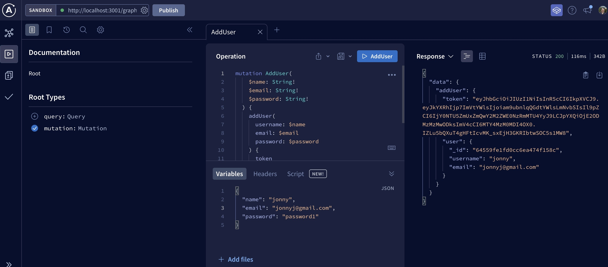

# Mern Book Search Engine

## Description

This project reformatted a CRUD React application to use an Apollo backend.

  ## Table of Contents
1. [Installation](#installation)
2. [Usage](#usage)
3. [Contributing](#contributing)
4. [Questions](#questions)
  

## Installation

This application only has a working backend and is unfinished.

## Usage

This project usage can be verified by using the Graphql sandbox. Included is a screenshot of the working app: 

## Contributing

<a href="https://github.com/harryhamlin">github.com/harryhamlin</a>

## Questions

For any questions, please reach out directly to <a href="mailto:harryhamlin@gmail.com" target="_blank">harryhamlin@gmail.com</a>.

